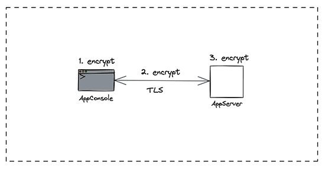
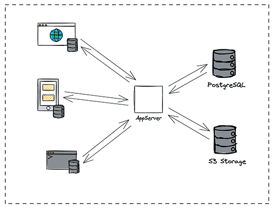

# go-keeper

Разработана клиент-серверная система, позволяющая пользователю надёжно и безопасно хранить логины, пароли, бинарные данные и прочую приватную информацию. Это финальный выпускной проект в рамках обучения по программе "Продвинутый Go-разработчик" на Яндекс.Практикуме в период с 29.11.2023 по 19.06.2024.

# Проектирование решения

Проработка решения:

Клиент. Ретраи:

Шифрование на всех уровнях:

Синхронизация с одним сервером:

Синхронизация с несколькими серверами:

Чистая архитектура на клиенте и сервере:

# Покрытие тестами

# Что применял?

- [x] Регистрация и аутентификация пользователей
- [x] Толстый консольный клиент
- [x] gRPC, включая логирование запросов и ответов
- [x] Шифрование на клиенте и сервере
- [x] Сервисный слой
- [x] Покрытие юнит-тестами 80% состояний
- [x] Описание экспортированных функций, типов, переменных, а также пакетов системы

# Диплом

[Документ в PDF](info/diplom-ayakimchuk.pdf)

# Рекомендации

[Документ в PDF](info/recommendation-ayakimchuk.pdf)